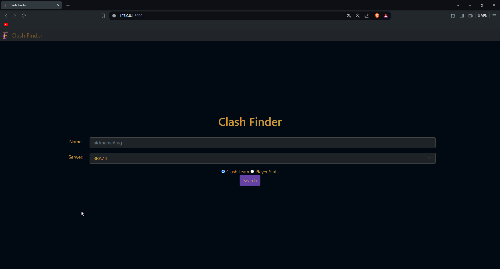

# Clash Finder 🎮

   

## Project Description 📋

Clash Finder is a comprehensive League of Legends web application built with Flask that allows players to analyze player statistics and view detailed match history. It emphasizes software quality and automated testing, demonstrating modern QA practices and serving as a portfolio project for full-stack development and testing skills.

The application features:

* Detailed player and match statistics (KDA, CS, items, runes, win/loss)
* Automatic resource updates for champion icons, items, runes, and other game assets
* Multi-region support for all major League of Legends servers
* Secure SSL/TLS communication
* Responsive design using Bootstrap 5

## Key Features ✨

* **Player Statistics**: Detailed match history with pagination, including KDA, CS, control wards, kill participation, win/loss tracking
* **Clash Team Info**: View Clash team compositions and statistics
* **Auto-updating Resources**: Detects new patches and updates game assets every 6 hours; manual trigger available
* **Responsive UI**: Clean, mobile-friendly interface built with Bootstrap 5
* **Secure API**: SSL/TLS configured with certifi
* **Caching & Optimization**: Custom timed cache, asynchronous batch requests, and rate-limit handling
* **Comprehensive Testing**: Unit, integration, and end-to-end tests covering core functionality and UI

## Table of Contents

* [Technologies](#technologies)
* [Prerequisites](#prerequisites)
* [Installation](#installation)
* [Configuration](#configuration)
* [Usage](#usage)
* [Screenshots](#screenshots)
* [API Endpoints](#api-endpoints)
* [Testing Strategy](#testing-strategy)
* [Project Structure](#project-structure)
* [Key QA Challenges](#key-qa-challenges)
* [Known Limitations & Roadmap](#known-limitations--roadmap)
* [Quality Metrics](#quality-metrics)
* [License](#license)
* [Contact](#contact)

## Technologies 🛠️

* **Backend**: Python 3.8+, Flask, aiohttp, asyncio, Requests
* **Frontend**: HTML5, CSS3, JavaScript (ES6+), Bootstrap 5
* **Data & Assets**: Riot Games API, Data Dragon API, Community Dragon API, Pillow
* **Security**: SSL/TLS via certifi
* **Caching**: Custom TTL cache decorator
* **Automation**: schedule for background updates
* **Testing & QA**: pytest, pytest-asyncio, Selenium WebDriver

## Prerequisites 📋

* Python 3.8 or higher
* pip (Python package manager)
* Riot Games API key (register at [https://developer.riotgames.com/](https://developer.riotgames.com/))
* Chrome/Chromium browser (for Selenium tests)
* **Certifi** for SSL verification (`pip install certifi`)
* **aiohttp** for asynchronous HTTP requests (`pip install aiohttp`)
* **Selenium** WebDriver (`pip install selenium`)

## Installation 🚀

1. **Clone the repository**:

   ```bash
   git clone https://github.com/Nossi201/Clash-Finder.git
   cd Clash-Finder
   ```
2. **Create and activate a virtual environment**:

   ```bash
   python -m venv venv
   source venv/bin/activate    # On Windows: venv\Scripts\activate
   ```
3. **Install core dependencies**:

   ```bash
   pip install -r requirements.txt
   ```
4. **Install additional dependencies for SSL, async, and Selenium**:

   ```bash
   pip install certifi aiohttp selenium
   ```

## Configuration ⚙️

1. Open `config.py` and set your keys:

   ```python
   # Riot API Key
   RIOT_API_KEY = "YOUR_RIOT_API_KEY"

   # Flask Secret Key (generate via `secrets.token_hex(32)`)
   FLASK_SECRET_KEY = "YOUR_FLASK_SECRET_KEY"
   ```
2. (Optional) Environment variables:

   * `RIOT_API_KEY`
   * `FLASK_SECRET_KEY`

## Usage 📝

1. Run the application:

   ```bash
   python app.py
   ```
2. Open your browser at `http://localhost:5000`.
3. Enter a summoner name (e.g., `Faker#KR1`) and select a region.
4. Choose between:

   * **Player Stats**: View detailed match history
   * **Clash Team**: View Clash team information

## Screenshots 📸

### Home Page



### Player History


### Match Detail View


## API Endpoints 🌐

* `GET /` — Home page
* `POST /Cheker` — Search player or team
* `GET /clash_team/<summoner_name>/<server>` — Clash team data
* `GET /player_stats/<summoner_name>/<server>` — Player match history
* `POST /load_more_matches` — Load additional matches
* `POST /api/resources/update` — Manual resource update
* `GET /api/resources/version` — Current resource version
* `POST /api/resources/force-update` — Force resource update

## Testing Strategy 🧪

### 1. Unit Tests (`test/test_app.py`)

* Data parsing and business logic validation
* URL conversion functions (slugify/unslugify)
* Over 25 parametrized test cases

### 2. Integration Tests (`test/test_question.py`)

* Riot Games API integration
* Asynchronous request handling
* Error and rate-limit scenarios

### 3. End-to-End (E2E) Tests (Selenium)

* `test_testSearchBar.py`: Search form functionality
* `test_testButtonShowMoreMatches.py`: Dynamic load more behavior
* `test_testCheckMoreStats.py`: Expanding detailed stats

**Run all tests**:

```bash
pytest test/ -v
pytest test/ --cov=. --cov-report=html
```

## Project Structure 📁

```
clash-finder/
├── app.py                  # Main Flask application
├── question.py             # API integration & data processing
├── config.py               # Configuration
├── game_constants.py       # LoL constants
├── resource_downloader.py  # Asset downloader
├── resource_manager.py     # Resource blueprint
├── auto_updater.py         # Background updater
├── ssl_env_config.py       # SSL setup
├── templates/              # HTML templates
├── static/                 # Static assets (img, css, js)
├── test/                   # Test suite (unit, integration, selenium)
└── requirements.txt        # Dependencies
```

## Key QA Challenges Addressed 🔍

* **External API Testing**: Caching, rate-limit handling, multi-region response validation, mocking in unit tests
* **Asynchronous Code**: Proper event-loop handling, concurrent request testing
* **Dynamic UI Testing**: AJAX loading, responsiveness, cross-browser checks
* **Test Data Management**: Parameterized fixtures, cleanup routines

## Known Limitations & Roadmap 🚧

### Current Limitations

* No API mocking in integration tests
* Limited performance testing coverage
* No CI/CD pipeline configured

### Roadmap

* [ ] Add GitHub Actions CI/CD
* [ ] Implement API mocking with pytest-mock
* [ ] Performance testing with Locust
* [ ] Docker containerization
* [ ] API documentation with Swagger

## Quality Metrics 📈

* **Unit Test Coverage**: 95% of core functions
* **Code Coverage**: 85%+ (goal: 90%+)
* **E2E Flows**: 3 main user journeys
* **Performance**: <2s for home page load

## License 📄

This project is licensed under the MIT License. See [LICENSE](LICENSE) for details.
---

*Not endorsed by Riot Games. League of Legends™ and Riot Games™ are trademarks of Riot Games, Inc.*
